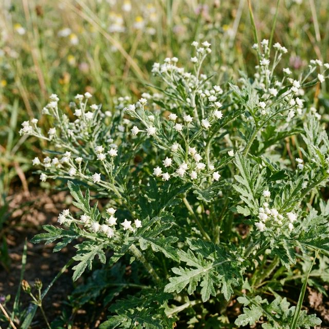

# BioGuard Tracker

An environmental monitoring application designed to track and report sightings of the invasive *Parthenium hysterophorus* (Carrot Grass) plant.



## Features
- **Interactive Dashboard:** View real-time statistics and heatmaps.
- **Reporting System:** Submit sightings with location data.
- **Admin Panel:** Manage and verify reports.
- **Fresh UI:** Modern, eco-friendly design with Tailwind CSS.

## Tech Stack
- **Frontend:** HTML5, Tailwind CSS, JavaScript
- **Backend:** Node.js, Express
- **Database:** PostgreSQL (Production), SQLite (Local Dev)

## Local Setup

1.  Clone the repository:
    ```bash
    git clone https://github.com/abhijeet06-sharma/Parthenium_Tracker.git
    cd Parthenium_Tracker
    ```

2.  Install dependencies:
    ```bash
    npm install
    ```

3.  Start the server:
    ```bash
    npm start
    ```

4.  Open `http://localhost:3000` in your browser.

## Deployment

You can deploy this application securely to Render with one click:

[](https://render.com/deploy?repo=https://github.com/abhijeet06-sharma/Parthenium_Tracker)

**Note:** On Render's free tier, the SQLite database file will be reset on every deployment. For persistent data, consider using a managed database service like Render PostgreSQL or Turso.